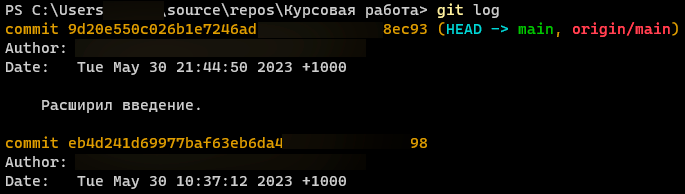
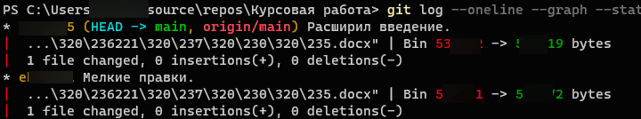

# Шпора по GIT

* **GIT** - это бесплатная распределённая система контроля версий с открытым исходным кодом, предназначенная для быстрой и эффективной работы с любыми проектами — от небольших до довольно крупных.

## Установка на системах семейства Windows

Официальный сайт системы — [git-scm.com](git-scm.com)
([Прямая ссылка на загрузку последней на октябрь 2023 года версии](https://github.com/git-for-windows/git/releases/download/v2.42.0.windows.2/Git-2.42.0.2-64-bit.exe)). На нём выбираем "Downloads", Winodws, "Click here to download"

Запускаем, устанавливаем.

Теперь можно проверить, успешно ли установился GIT. Вводим следующую команду.

```powershell
git version
```

Если всё было выполнено верно, в консоль будет выведена запись, похожая на это.
```powershell
git version 2.33.0.windows.2
```
* *Если же команду исполнить не удалось, то нужно будет либо переустанавливать, либо вручную прописать переменые окружения PATH.*
## Настройки
```powershell
git config --list --show-origin
```
Выведет все переменные настроек, их значения, места хранения.

Сперва, имя и почта не будут заданы, для этого нужно будет прописать следующие команды.

```powershell
git config user.name "Имя пользователя"
git config user.email почта@название.домен
```
Например*.
```powershell
git config --global user.name "Ivan"
git config --global user.email ivan@mail.ru
```

* *\* Если указать опцию "--global", то команды применяется ко всем будущим репозиториям, иначе — только в том, в котором происходит работа.*

 Если необходио изменить название главной ветки по умолчанию при создании репозитория, то можно прописать это в настройки по тому же принципу.
```powershell
git config --global init.defaultBranch main
```

## Создание локального репозитория

Для инициализации локального репозитория нужно перейти в по пути проекта и ввести следующую команду.
```powershell
git init
```

## Проверка изменений в локальном репозитории

Проверить инициализацию репозитория можно командой (в дальнейшем с её же помощью можно проверять наличие изменений в файлах проекта)

```powershell
git status
```

## Добавление файла для отслеживания

Для отслеживания изменений, системе нужно указать, какие файлы отслеживать при каждой фиксации. Можно как вручную перечислить все, прописывая название после команды, либо использвоть точку — добавит все файлы. Важно, чтобы перед использованием последней команды, вы настроли файл gitignore и были точно уверены, что не добавиться ничего лишнего (просмотрите git status).

```powershell
git add <имя файла.расширение>
git add .
```

## Немного подробнее про gitignore
Не все файлы нужно отслеживать, т.к. например, они могут содеражть личную информацию, быть слишком крупными и т.д. Для этого есть файл `.gitignore`, в нём прописываются шаблоны файлов, что GIT будет игнорировать.

Пример заполнения.
```gitignore
/[Ll]ibrary/
*.csproj
*.unityproj
*.sln
*.suo
*.tmp
```

## Фиксация изменений

Как только командой `git add` все нужные файлы были добавлены, можно создать зафиксировать их состояние следующей коммандой. Ключом `-m` указывается сообщение коммита, в нём описываются произведённые изменения, обычно. Сообщение обязательно, поэтому, если ключ не указать, откроется текстовый редактор для записи.

```powershell
git commit -m "текст"
```

## Изменение последнего коммита

Если забыли что-либо добавить в коммит, можно это изменить следующей командой. Главное, добавить изменения при помощи `git add` заранее.
 ```powershell
git commit --amend
```

## Просмотр коммитов

Для прсомтотра списка коммитов используется команда. На второй строчке указанны часто используемые ключи, чтобы улучшить вывод информации. Первый ключ — выводит данные в сжатом формате, второй ключ — визуализирует историю в виде графа, третий — показывает статистику изменений по коммитам.

```powershell
git log
git log --oneline --graph --stat
```
Вывод соответсвенно.




## Просмотри отличий коммитов

Разницу между коммитами выводит следующая команда.

```powershell
git diff <первый коммит> <второй коммит>
```
Если не указать аргументов, будет выведена разница между последним коммитом и текущей версией.

## Перемещения между коммитами и ветками

Для перехода  необходимо использовать следующую команду.

```powershell
git checkout <сокращенное название коммита>
```

Если необходимо переключиться на последний коммит или другую ветку, указывается название необходимой ветки.

```powershell
git checkout <название ветки>
```

## Создание ветвей

Можно создавать отдельные ветки на примере графа ниже.


С их помощью, например, можно тестировать различный функционал, не ломая при этом основное приложение.

Создаются они посредством следующей команды.

```powershell
git branch <название ветки>
```

## Слияние веток, merge

Для слияния двух веток иапользуется команда. Сливает указанную ветку и текующу.

```powershell
git merge <названеи ветки>
```

Если при слиянии обнаружились изменения в одних и тех же участках, возникают конфликты. Они решаются либо вручную, либо посредством установленных правил автоматически.

* *После исполнения команды изменения автоматически не сохраняются, нужно зафиксировать из в коммите.*

## Синхронизация репозитория с облачным хранилищем

### Авторизация в облачном хранилище репозиториев

Для подключения аккаунта удалённого репозитория, необходимо выполнить одну из нижеперечисленных команд, например, pull. Будет предложено авторизоваться.

### Подключение

Для подключения внешнего репозитория необходимо ввести следующую команду, где необходимо указать ярлык для локального представления удалённой ветки, а так же сслыку до этой ветки.

```powershell
git remote add <название, синоним репозитория> <ссылка>
git remote add origin https://github.com/torvalds/linux.git
```

### Подгрузка уже существующего удалённого репозитория

```powershell
git clone <ссылка>
git clone https://github.com/torvalds/linux.git
```

Репозиторий будет скачен.

### Получение изменений из удалённого репозитория

Команда ниже покажет изменения на удалённом репозитории, но не будет их подгружать в локальный (в этом, кстати, отличе от `git pull`)

```powershell
git fetch <название, синоним репозитория>
git fetch origin
```

### Подгрузка изменений

Команда ниже подгрузить изменения с удалённого

```powershell
git pull <название, синоним репозитория>
git pull origin
```
* *\*По своей сути, выполняем `git fetch` и `git merge` одной командой.*

### Загрузка своих коммитов в облако

Когда коммит уже создан на локальном репозитории, его можно запушить, т.е. загрузить на удалённый репозиторий посредством следующей команды.

```powershell
git push <название, синоним репозитория>
git push origin
```

* *Есть нюанс — если на удалённой ветке есть коммиты, которые были сделаны позже, то автоматически слияние выполнить не получится. Есть вариант использовать ключ `--force`, что сотрёт коммиты на удалённом репозитории в пользу загружаемых, что не рекомендуктся. Можно так же использовать ключ `--force-with-lease`, он не удалит чужие коммиты, выдаст ошибку при их наличии, но свои удалит, т.е. выложенные с того же аккаунта.*